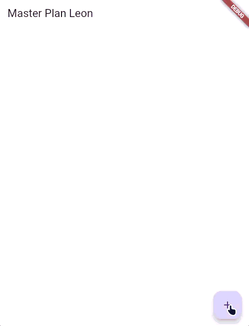
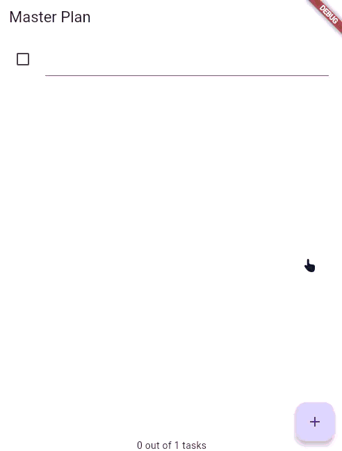

# Praktikum 1: Dasar State dengan Model-View

## 1. Selesaikan langkah-langkah praktikum tersebut, lalu dokumentasikan berupa GIF hasil akhir praktikum beserta penjelasannya di file README.md! Jika Anda menemukan ada yang error atau tidak berjalan dengan baik, silakan diperbaiki.
 
## 2. Jelaskan maksud dari langkah 4 pada praktikum tersebut! Mengapa dilakukan demikian?

Langkah 4: Buat file data_layer.dart berisi:
Kita dapat membungkus beberapa data layer ke dalam sebuah file yang nanti akan mengekspor kedua model tersebut. Dengan begitu, proses impor akan lebih ringkas seiring berkembangnya aplikasi. Buat file bernama data_layer.dart di folder models. Kodenya hanya berisi export seperti berikut.

``` dart
export 'plan.dart';
export 'task.dart';
```
### Penjelasan:
#### Langkah 4 membuat file data_layer.dart yang berfungsi sebagai barrel file atau re-export file. File ini mengumpulkan dan mengekspor ulang beberapa file model (plan.dart dan task.dart) dalam satu tempat. Fungsinya?

#### 1. Menyederhanakan Import: Alih-alih melakukan import terpisah untuk setiap model, Cukup dengan satu import yaitu data_layer.dart
#### 2. Maintainability: Ketika aplikasi berkembang dan memiliki banyak model, file data_layer.dart memudahkan pengelolaan dependencies.
#### 3. Encapsulation: Menyembunyikan detail implementasi internal dan memberikan interface yang bersih untuk akses ke data models.

## 3. Mengapa perlu variabel plan di langkah 6 pada praktikum tersebut? Mengapa dibuat konstanta ?

Langkah 6:
Pada folder views, buatlah sebuah file plan_screen.dart dan gunakan templat StatefulWidget untuk membuat class PlanScreen. Isi kodenya adalah sebagai berikut. Gantilah teks ‘Namaku' dengan nama panggilan Anda pada title AppBar.

``` dart
class _PlanScreenState extends State<PlanScreen> {
  Plan plan = const Plan();
```

### Penjelasan:
Variabel plan menyimpan state/data aplikasi (daftar tugas dan informasinya). Diperlukan untuk menampilkan data dan mengupdate UI ketika ada perubahan melalui setState().

Mengapa dibuat konstanta (const):

Nilai awal yang immutable: Memberikan state awal kosong saat aplikasi pertama kali dijalankan
Optimasi performa: Objek const dibuat saat compile-time, lebih efisien
Immutable pattern: Setiap perubahan membuat instance Plan baru, bukan memodifikasi yang lama. Ini membuat state lebih predictable dan aman dari side effects

## 4. Lakukan capture hasil dari Langkah 9 berupa GIF, kemudian jelaskan apa yang telah Anda buat!

### Penjelasan: 
Aplikasi ini mendemonstrasikan konsep dasar State Management di Flutter menggunakan Model-View pattern dengan model data yang immutable.
## 5. Apa kegunaan method pada Langkah 11 dan 13 dalam lifecyle state ?
### Penjelasan:
initState() untuk setup awal, dispose() untuk cleanup akhir. Kedua method ini penting dalam lifecycle management Flutter untuk mencegah memory leak dan memastikan performa aplikasi optimal.
## 6. Kumpulkan laporan praktikum Anda berupa link commit atau repository GitHub ke dosen yang telah disepakati !

# Praktikum 2: InheritedWidget

## 1. Selesaikan langkah-langkah praktikum tersebut, lalu dokumentasikan berupa GIF hasil akhir praktikum beserta penjelasannya di file README.md! Jika Anda menemukan ada yang error atau tidak berjalan dengan baik, silakan diperbaiki sesuai dengan tujuan aplikasi tersebut dibuat.
 
## 2. Jelaskan mana yang dimaksud InheritedWidget pada langkah 1 tersebut! Mengapa yang digunakan InheritedNotifier?

Langkah 1: Buat file plan_provider.dart
Buat folder baru provider di dalam folder lib, lalu buat file baru dengan nama plan_provider.dart berisi kode seperti berikut.
``` dart
import 'package:flutter/material.dart';
import '../models/data_layer.dart';

class PlanProvider extends InheritedNotifier<ValueNotifier<Plan>> {
  const PlanProvider({super.key, required Widget child, required
   ValueNotifier<Plan> notifier})
  : super(child: child, notifier: notifier);

  static ValueNotifier<Plan> of(BuildContext context) {
   return context.
    dependOnInheritedWidgetOfExactType<PlanProvider>()!.notifier!;
  }
}
```
### Penjelasan:
#### Yang dimaksud InheritedWidget adalah InheritedNotifier<ValueNotifier<Plan>> yang menjadi parent class dari PlanProvider. Mengapa menggunakan InheritedNotifier?

#### 1. Auto Rebuild: Ketika ValueNotifier<Plan> berubah, InheritedNotifier otomatis memberitahu semua widget yang menggunakannya untuk rebuild. Tidak perlu manual setState().
#### 2. Efficient Update: Hanya widget yang menggunakan PlanProvider.of(context) yang akan rebuild saat data berubah, bukan seluruh widget tree.
#### 3. Easy Access: Method of(context) memudahkan akses ke ValueNotifier<Plan> dari mana saja di widget tree tanpa passing props manual.

## 3. Jelaskan maksud dari method di langkah 3 pada praktikum tersebut! Mengapa dilakukan demikian?

Langkah 3: Tambah method pada model plan.dart
Tambahkan dua method di dalam model class Plan seperti kode berikut.


``` dart
int get completedCount => tasks
  .where((task) => task.complete)
  .length;

String get completenessMessage =>
  '$completedCount out of ${tasks.length} tasks';
```

### Penjelasan:
Variabel plan menyimpan state/data aplikasi (daftar tugas dan informasinya). Diperlukan untuk menampilkan data dan mengupdate UI ketika ada perubahan melalui setState().

Mengapa dibuat konstanta (const):

Nilai awal yang immutable: Memberikan state awal kosong saat aplikasi pertama kali dijalankan
Optimasi performa: Objek const dibuat saat compile-time, lebih efisien
Immutable pattern: Setiap perubahan membuat instance Plan baru, bukan memodifikasi yang lama. Ini membuat state lebih predictable dan aman dari side effects

## 4. Lakukan capture hasil dari Langkah 9 berupa GIF, kemudian jelaskan apa yang telah Anda buat!

### Penjelasan: 
Praktikum 2 mengubah state management dari pendekatan lokal (setState()) menjadi shared state menggunakan InheritedNotifier dan ValueNotifier. Variabel plan yang sebelumnya ada di _PlanScreenState dihapus dan diganti dengan akses state melalui PlanProvider.of(context). Di main.dart, PlanScreen dibungkus dengan PlanProvider yang menyediakan ValueNotifier<Plan> ke seluruh widget tree. UI diubah dengan menambahkan ValueListenableBuilder untuk mendengarkan perubahan state dan auto-rebuild, serta menampilkan progress indicator ("X out of Y tasks") di bawah list menggunakan method completenessMessage. Layout body sekarang menggunakan Column dengan Expanded untuk list dan SafeArea untuk pesan progress. Perubahan ini membuat state management lebih terstruktur, mudah di-share antar widget, dan lebih efisien karena hanya widget yang menggunakan data yang akan rebuild.

## 5. Kumpulkan laporan praktikum Anda berupa link commit atau repository GitHub ke dosen yang telah disepakati !

# Praktikum 3: Membuat State di Multiple Screens

## 1. Selesaikan langkah-langkah praktikum tersebut, lalu dokumentasikan berupa GIF hasil akhir praktikum beserta penjelasannya di file README.md! Jika Anda menemukan ada yang error atau tidak berjalan dengan baik, silakan diperbaiki sesuai dengan tujuan aplikasi tersebut dibuat.
 
## 2. Berdasarkan Praktikum 3 yang telah Anda lakukan, jelaskan maksud dari gambar diagram berikut ini!

 
### Penjelasan:
#### Dari single-screen menjadi multi-screen navigation, memisahkan tampilan daftar plans dan detail tasks per plan. Ini membuat aplikasi lebih terstruktur dan scalable untuk mengelola multiple plans.

## 3. Lakukan capture hasil dari Langkah 14 berupa GIF, kemudian jelaskan apa yang telah Anda buat!


## 4. Kumpulkan laporan praktikum Anda berupa link commit atau repository GitHub ke dosen yang telah disepakati !