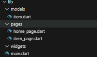
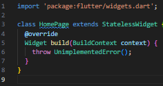
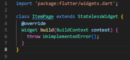
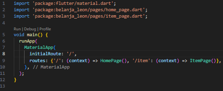
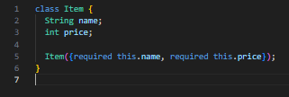
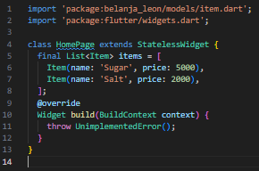
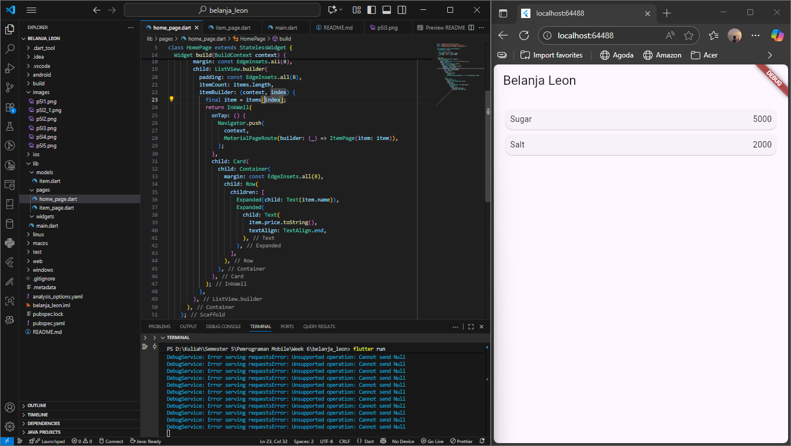
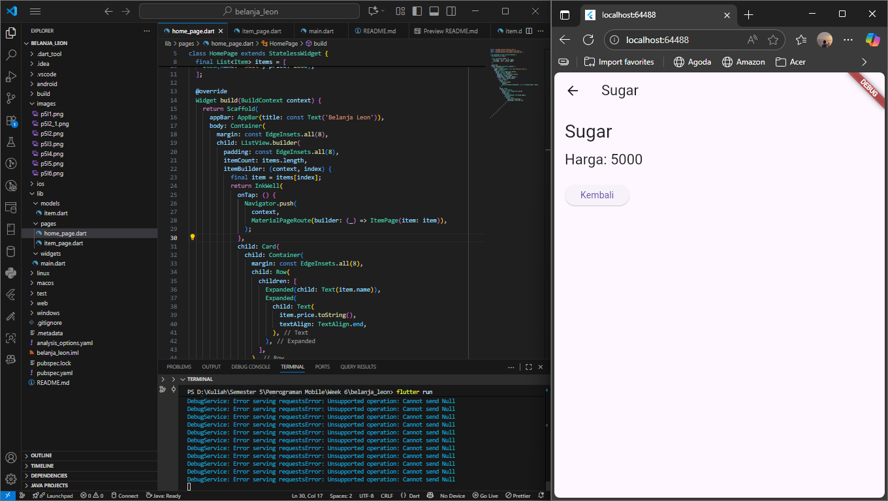
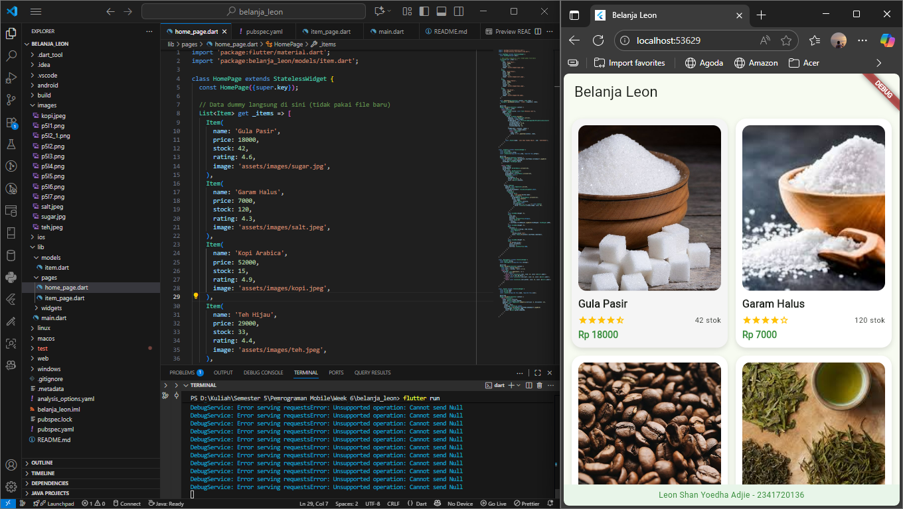
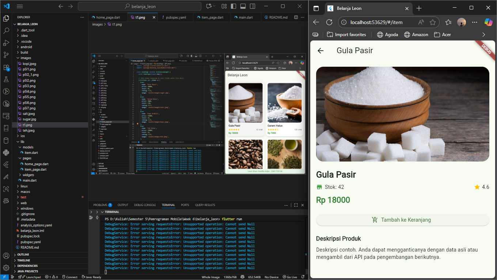

# belanja_leon

A new Flutter project.

# Praktikum 5: Membangun Navigasi di Flutter

## Langkah 1: Siapkan project baru

## Langkah 2: Mendefinisikan Route

## Langkah 3: Lengkapi Kode di main.dart

## Langkah 4: Membuat data model

## Langkah 5: Lengkapi kode di class HomePage

## Langkah 6: Membuat ListView dan itemBuilder

## Langkah 7: Menambahkan aksi pada ListView

# Tugas Praktikum

