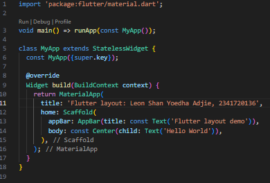
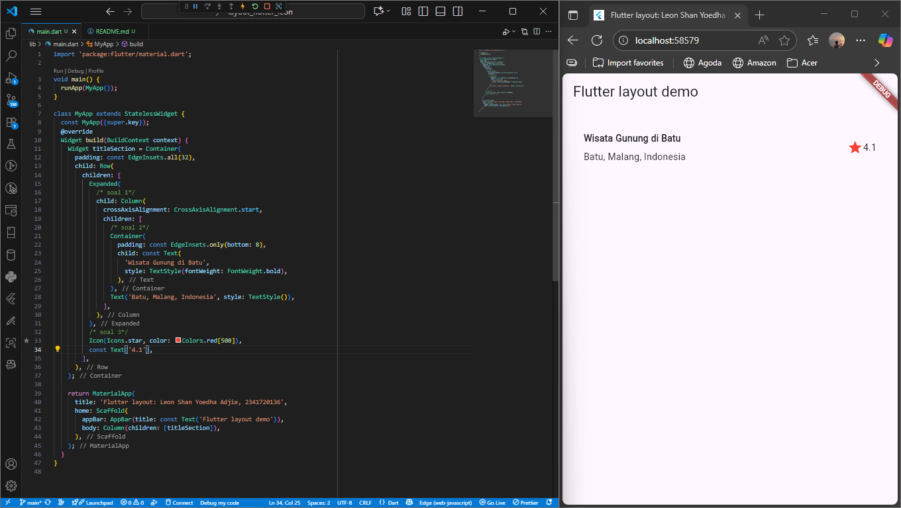
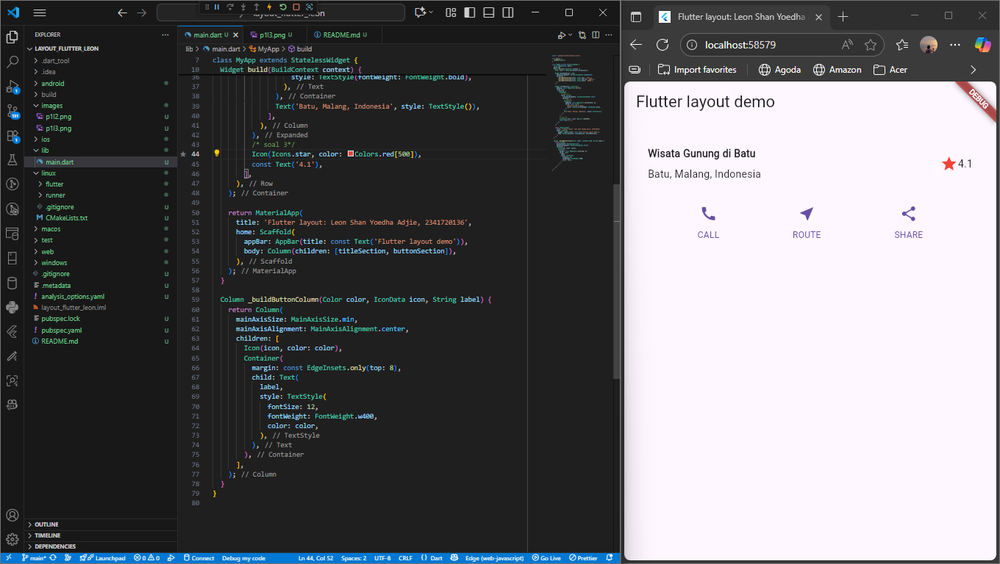
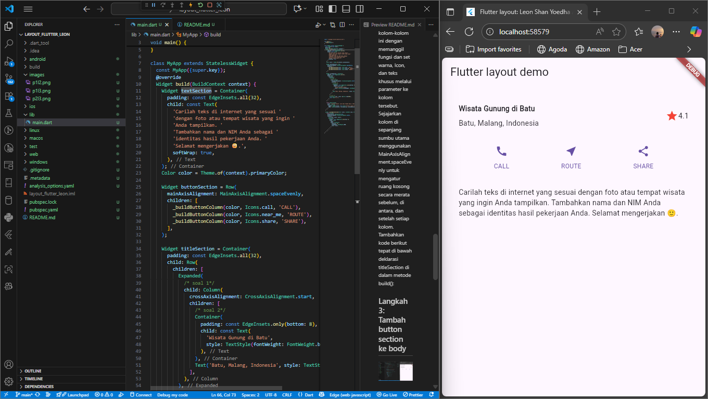
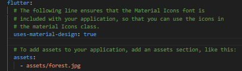
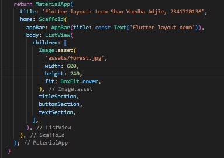
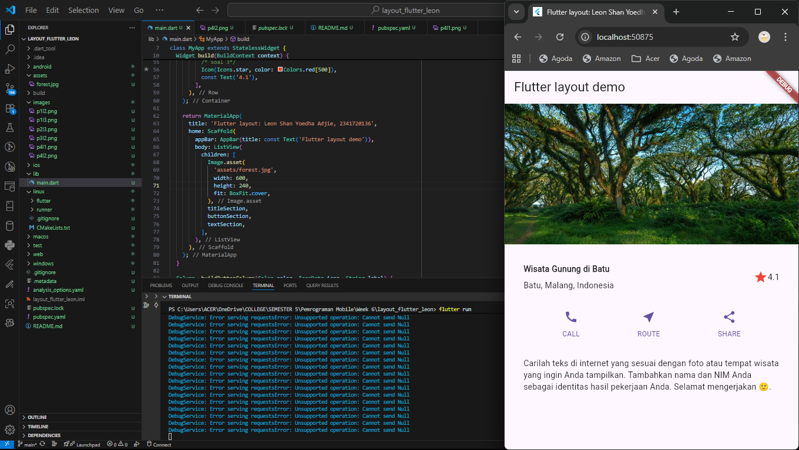
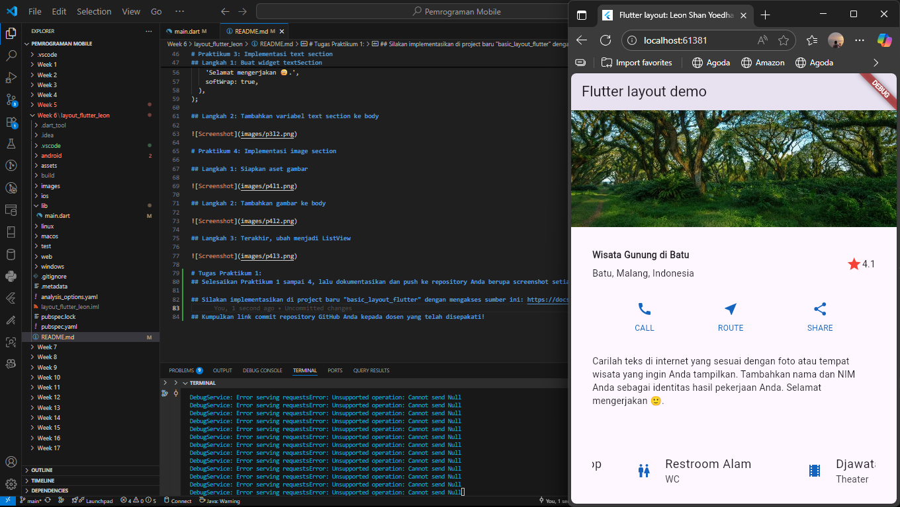

# layout_flutter_leon

## Leon Shan Yoedha Adjie (2341720136)

# Praktikum 1
## Langkah 1: Buat Project Baru

Buatlah sebuah project flutter baru dengan nama layout_flutter. Atau sesuaikan style laporan praktikum yang Anda buat.

## Langkah 2: Buka file lib/main.dart

## Langkah 3: Identifikasi layout diagram
Langkah pertama adalah memecah tata letak menjadi elemen dasarnya:

- Identifikasi baris dan kolom.

- Apakah tata letaknya menyertakan kisi-kisi (grid)?

- Apakah ada elemen yang tumpang tindih?

- Apakah UI memerlukan tab?

- Perhatikan area yang memerlukan alignment, padding, atau borders.

## Langkah 4: Implementasi title row

# Praktikum 2
## Langkah 1: Buat method Column _buildButtonColumn
Bagian tombol berisi 3 kolom yang menggunakan tata letak yang sama—sebuah ikon di atas baris teks. Kolom pada baris ini diberi jarak yang sama, dan teks serta ikon diberi warna primer.

Karena kode untuk membangun setiap kolom hampir sama, buatlah metode pembantu pribadi bernama buildButtonColumn(), yang mempunyai parameter warna, Icon dan Text, sehingga dapat mengembalikan kolom dengan widgetnya sesuai dengan warna tertentu.

## Langkah 2: Buat widget buttonSection
Buat Fungsi untuk menambahkan ikon langsung ke kolom. Teks berada di dalam Container dengan margin hanya di bagian atas, yang memisahkan teks dari ikon.

Bangun baris yang berisi kolom-kolom ini dengan memanggil fungsi dan set warna, Icon, dan teks khusus melalui parameter ke kolom tersebut. Sejajarkan kolom di sepanjang sumbu utama menggunakan MainAxisAlignment.spaceEvenly untuk mengatur ruang kosong secara merata sebelum, di antara, dan setelah setiap kolom. Tambahkan kode berikut tepat di bawah deklarasi titleSection di dalam metode build():

## Langkah 3: Tambah button section ke body

# Praktikum 3: Implementasi text section
## Langkah 1: Buat widget textSection
Widget textSection = Container(
  padding: const EdgeInsets.all(32),
  child: const Text(
    'Carilah teks di internet yang sesuai '
    'dengan foto atau tempat wisata yang ingin '
    'Anda tampilkan. '
    'Tambahkan nama dan NIM Anda sebagai '
    'identitas hasil pekerjaan Anda. '
    'Selamat mengerjakan 🙂.',
    softWrap: true,
  ),
);

## Langkah 2: Tambahkan variabel text section ke body

# Praktikum 4: Implementasi image section

## Langkah 1: Siapkan aset gambar

## Langkah 2: Tambahkan gambar ke body

## Langkah 3: Terakhir, ubah menjadi ListView

# Tugas Praktikum 1:
## Selesaikan Praktikum 1 sampai 4, lalu dokumentasikan dan push ke repository Anda berupa screenshot setiap hasil pekerjaan beserta penjelasannya di file README.md!

## Silakan implementasikan di project baru "basic_layout_flutter" dengan mengakses sumber ini: https://docs.flutter.dev/codelabs/layout-basics

## Implementasi List View

## Kumpulkan link commit repository GitHub Anda kepada dosen yang telah disepakati!