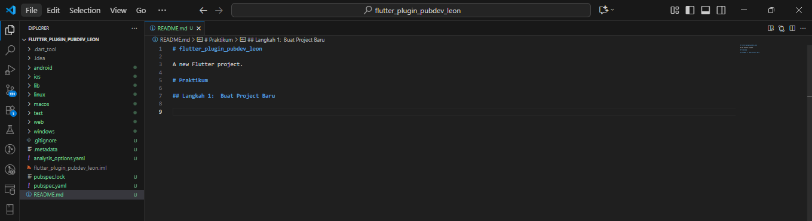
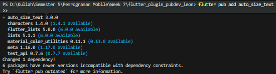
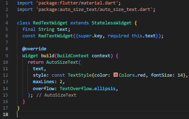
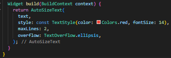
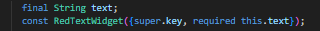
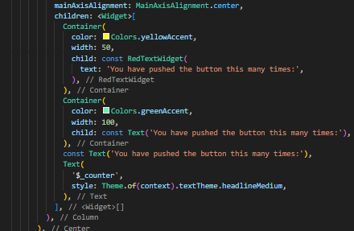
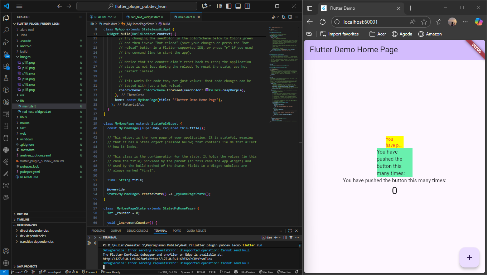

# flutter_plugin_pubdev_leon

A new Flutter project.

# Praktikum

## Langkah 1:  Buat Project Baru

## Langkah 2: Menambahkan Plugin

## Langkah 3: Buat file red_text_widget.dart

## Langkah 4: Tambahkan Widget AutoSizeText

## Langkah 5: Buat Variabel text dan parameter di constructor

## Langkah 6: Tambahkan widget di main.dart

# Tugas Praktikum

## Jelaskan maksud dari langkah 2 pada praktikum tersebut!
Membuat widget AutoSizeText dari pihak ketiga yang dapat mengubah ukuran font secara otomatis agar teks muat di area yang dibatasi.
## Jelaskan maksud dari langkah 5 pada praktikum tersebut!
Menambahkan final String text; membuat RedTextWidget menerima data teks dari parent (widget pemanggil). Menambahkan required this.text di konstruktor memastikan properti text wajib diisi saat membuat RedTextWidget 
## Pada langkah 6 terdapat dua widget yang ditambahkan, jelaskan fungsi dan perbedaannya!
- AutoSizeText: mengubah ukuran font agar muat (dengan batas maxLines), dan dapat menerapkan ellipsis jika tetap tidak muat.
- Text: tidak auto-resize; perilaku wrapping/overflow mengikuti parameter yang Anda set (di contoh tidak diatur, jadi membungkus sebanyak yang diperlukan).
- Secara visual, yang pertama cenderung lebih ringkas (dibatasi 2 baris + ellipsis), yang kedua bisa memanjang ke bawah sesuai kebutuhan.
## Jelaskan maksud dari tiap parameter yang ada di dalam plugin auto_size_text berdasarkan tautan pada dokumentasi ini !
- Argumen posisi pertama (text):
String yang akan ditampilkan. Untuk rich text tersedia konstruktor AutoSizeText.rich dengan TextSpan.
- style: TextStyle(...)
Mengatur gaya teks: warna, ukuran font awal, ketebalan, dsb. AutoSizeText akan memulai pencarian ukuran dari style.fontSize lalu menyesuaikan ke bawah/atas dalam rentang yang diizinkan.
- maxLines: 2
Batas jumlah baris maksimum yang boleh dipakai. AutoSizeText akan menyesuaikan ukuran font supaya teks muat dalam jumlah baris ini.
- overflow: TextOverflow.ellipsis
Perilaku jika setelah penyesuaian ukuran font teks masih tidak muat dalam maxLines. Dengan ellipsis, teks dipotong dan diakhiri “...”.