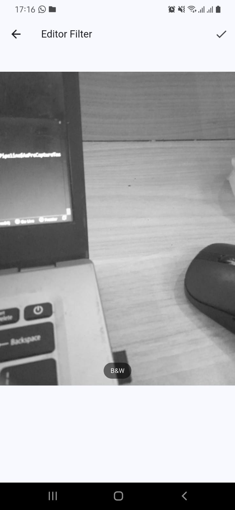

# tugas_praktikum_kamerafilter

A new Flutter project.

## Gabungkan hasil praktikum 1 dengan hasil praktikum 2 sehingga setelah melakukan pengambilan foto, dapat dibuat filter carouselnya!

## Jelaskan maksud void async pada praktikum 1?

async memungkinkan penggunaan await untuk menunggu inisialisasi kamera sebelum runApp, tanpa membekukan aplikasi. Gunakan Future<void> main() async.

## Jelaskan fungsi dari anotasi @immutable dan @override ?

@Immutable Menandai bahwa objek kelas tersebut bersifat tak berubah (immutable) setelah dibuat. Semua field seharusnya final.

@Override Menandai bahwa sebuah method/field sedang “meng-override” member dari superclass atau interface.
